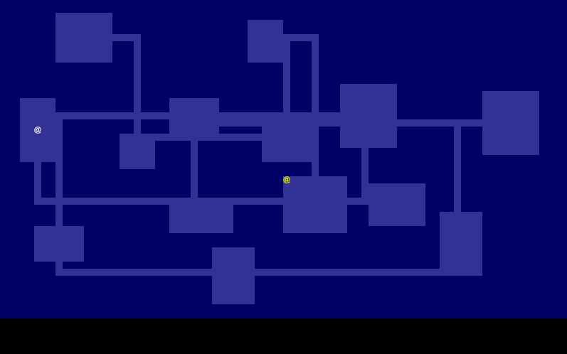

# Pre-100 Days Of Code - Log

## Preamble
### Reflection and reasoning

Since rules of #100DaysOfCode specifically mentioned that tutorials can't be count as code, so I started with "Pre-100 Days of Code".

I failed miserabily in my last attempt to do 100 Days of Code. But even for current attempt I'm not sure if I can proceed at least half the challenge. Therefore I think I need to start with something easier: pre-challege to get the feeling and set the step for real challenge later on.

For my PhD work, I need to understand and code with Python and a bit of Fortran, and learning hardware such as RPi and Arduino. But I also interested in learning other language such as Rust and understand how web works (front/back-end developer)

I'm currently busy with my experiment seup and got involved with other research projects. I think I may not able to religiously code everyday, but I'll try my best. Even if I code twice a week, but consistently do it, I satisfied.

---

### Planning
I code Python for my research project, Rust for tutorial (I have no idea about what kind of project that I can do with Rust), and sometimes poking around web development. So in this stage, I will shift between these two language, one for my real life research project, the other just for the sake of learning.

So for today R0D0, I start with Rust tutorial. Let's git started.

---

### Day 0: September 26, 2019

**Today's Progress**: Started Rust tutorial, configure Rust installation and basic Hello world tutorial

**Thoughts:** Although the installationa ns basic syntax is easy but configuration is something I still not clearly understand. Especially setting Cargo.toml.
P/s: I forgot how to change terminal in VS Code to bash! End up with Powershell.

**Link to work:** Stop at  [adding things up](http://stevedonovan.github.io/rust-gentle-intro/1-basics.html#adding-things-up).

---
### Day 1: September 30, 2019

**Note**: Skip a couple of days since I stayed up in my friends home and later went back to my hometown (I don't have laptop to do any works there)
**Today's Progress**: Change tutorial from A Gentle Intro to [Rust to The Rust Programming Language by Steve Klabnik and Carol Nichols](https://doc.rust-lang.org/book/index.html#the-rust-programming-language) since it cover about Rust from very basic, including how to set up Rust environment and how to use Cargo from the very beginning.

**p/s:** While I'm writing this log, suddenly blackout! Part of the writin was missing. And I can't update it on time.

**Link to work:** Cover [Chapter 2: Programming a Guessing Game](https://www.simonpbriggs.co.uk/rust.pdf)

---
### Day 2: October 1, 2019

**Today's progress:** I stayed up in my friend's house and can't do anything regarding coding. But I read [Chapter 3: Common Programming Concept](https://www.simonpbriggs.co.uk/rust.pdf) up until Functions.

**Link to work:** TODO: Cover Comments and Control Flow. Try to understand and code Ownership.

---
### Day 3: October 2, 2019

**Today's Progress:** Manage to do control flow chapter of Rust programming book. Also tried to setup OctoPi for my 3D printer project (Ender 3 Pro). But can't do ssh maybe problem with WiFi setup and due to the screen resolution is wet too high for my 3.5 Inch display. Need to change it later.

**p/s:** Today I get asked from someone about building a web page for some conference. I rejected the offer due to my lack understanding about web dev and Javascript. Another todo list: know how to build a basic web page.

**p/s2:** Tomorrow I will be out of town for some work for four days. I don't know how to do this challege for the whole time there.

**Link to work:** for [OctoPi](https://octoprint.org/download/)


---
### Day 3.5: October 3-7, 2019

**Today's Progress:** During this period, I read (but not code) about Rust Control Flow and [Ownership](https://doc.rust-lang.org/book/ch04-00-understanding-ownership.html) concept.

---
### Day 4: October 8, 2019

**Today's Progress:** I tried to visualised my progress using git-like graph. I tried using [gitgraph/js](https://gitgraphjs.com/#0) however it's quite tricky to change it to suit my purpose where I can't remove hash number but other than that it seems easy to use provided that I know enough about Javascript framework.

For Rust programming, I tried poking around [Learn Rust With Entirely Too Many Linked Lists](https://rust-unofficial.github.io/too-many-lists/index.html) but it seems that the author assumed the readers have basic knowledge about Rust language, i.e. syntax and how to create and run library-ish. After I cover the basic about Rust, I might be try to read this book.

---
### Day 5: October 9, 2019

**Today's Progress:** Finish about Rust ownership (part I?)
A bit lost on the later part of the chapter.

**Link to work:** next is [References and Borrowing](https://doc.rust-lang.org/book/ch04-02-references-and-borrowing.html)

---
### Day 6: October 10, 2019

**Today's Progress:** Finish about Rust References and Borrowing. I'm not really  understand about this concept though. Might read and practice about it later.

**Link to work:** [The Slice Type](https://doc.rust-lang.org/book/ch04-03-slices.html)


---
### Day 7: October 11, 2019

**Today's Progress:** Today I tried to create a game in Rust (Roguelike).
 
*Notes*:
1. Author use different way to execute program (cargo run --release). I stick to cargo check
2. Typo and syntax error. My main weakness so far. Mostly on ";" and on a lesser extend, "()".
3. Rust: 
   1. use xx::yy::zz
4. is similar to Python:
   1. import xx.yy.zz
5. Convention: use UPPERCASE letter for const
6. New thing that still not covered by reading Rust-lang: book:
   1. use
   2. struct
   3. cargo new --bin. The "--bin" part

**Link to work:** [Graphics](https://tomassedovic.github.io/roguelike-tutorial/part-1-graphics.html)


---
### Day 8: October 13, 2019

**Today's Progress:** Continue create a Roguelike game in Rust

__*Notes Part One*__:
* Line 78 `tcod.root.wait_for_keypress(true);` is not present in this or later tutorial (present in Graphic tutorial [1a-render]), can ask them later about this?
* If the name is different than `main.rs`, need to declare in Cargo.toml file, say `test.rs` as:
    ```rust
    [[bin]]
    name = "test"
    path = "src/test.rs"
    ```
* If `use` is use inside function, it will only available for that function.
* Function signature in Rust: `fn func_name(param:type, ..) -> return type`.
* `(param:type,..)` the ".." means don't care about other fields
* `_=>{}` = value that matches everything else.

__*Notes Part Two*__:
* Today I learned a bit about class (`Object` part in Part-2a). I think this is an OOP concept. At last I learned something from OOP. In Rust?
* `dyn` is a trait and not a concrete type (such as `struct` or `enum`).
* Learned a concept of "blit".

**Link to work:** [Generalising](https://tomassedovic.github.io/roguelike-tutorial/part-2-object-map.html)


---
### Day 9: October 19, 2019

**Today's Progress:** For couple of days before, I spent time for designing 3D printed stuff, thus not having time for coding.

__*Notes Part One*__:
* Spending a significant time (on afternoon session and night session) for debugging the code. Even though there's code provided, I still get lots of compile errors
* TYPO YPO TYPO.
* Also, coding structure in Rust.
* Need to brush a bit about mut, &xyz, and struct etc.

__*Notes Part Two*__:
* Change a bit about directory structure: New codes always in main.rs. After finish the part, save main.rs as part--.rs.
* So no need to redefine what file to execute in Cargo.toml
  
__*Errors*__:
1. my character doesn't move: did not put (`+=dx/+=dy`):
    ```rs
        pub fn move_by(&mut self, dx: i32, dy: i32, game: &Game) {
        if !game.map[(self.x + dx) as usize][(self.y + dy) as usize].blocked {
            self.x += dx;
            self.y += dy;
        }
    }
    ```
2. Map didn't show room: did not replace `empty` to `wall` in `map_make` function:
   ```
   let mut map = vec![vec![Tile::wall(); MAP_HEIGHT as usize]; MAP_WIDTH as usize];
   ```
3. Todays work:


**Link to work:** [Dungeon generators](https://tomassedovic.github.io/roguelike-tutorial/part-3-dungeon.html)

---
### Day 10: October 23, 2019

**Today's Progress:** Too tired to finish tutorial for today. Still have errors.

**Link to work:** [FOV](https://tomassedovic.github.io/roguelike-tutorial/part-4-fov-exploration.html)


---
### Day 11: October 23, 2019

**Today's Progress:** 
1. Tracking error from yesterday's activity.
2. Culprit: "}" in line 278 part-4a-fov.rs
3. Also detected several typos (again!): ```plaer``` -> ```player```, ```tcod.fov.in_in_fov``` -> ```tcod.fov.is_in_fov```
4. Should not practice keyboard typing using all fingers during coding: produced lots of typos
5. to learn: the * in ```*explored``` (line 264 in part-4b-exploration.rs)
6. Current code (part 5) still have errors.

**Link to work:** Until [Ownership woes](Ownership woes
)
